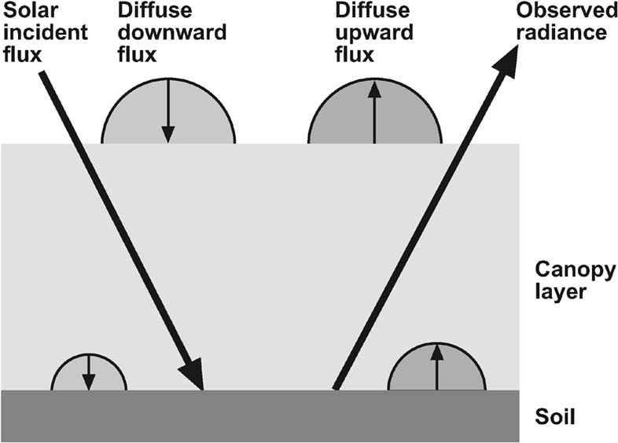
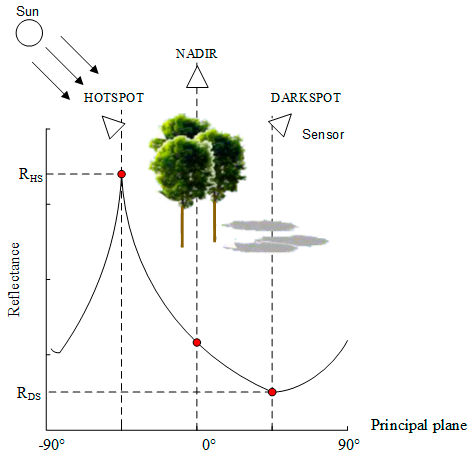

# Espectro vegetacion md
Este cuaderno digital interactivo tiene como objetivo demostrar las relaciones entre las propiedades fisico-químicas de la vegetación y el espectro solar.

Para ello haremos uso de modelos de simulación, en particular de modelos de transferencia radiativa tanto a nivel de hoja individual como a nivel de dosel vegetal.

# Instrucciones
Lee con detenimiento todo el texto, y sigue sus instrucciones.

Una vez leida cada sección de texto ejecuta la celda de código siguiente (marcada como `In []`) presionando el icono de `Run`/`Ejecutar` o presionando en el teclado ALT + ENTER. Aparecerá una interfaz gráfica con la que poder realizar las tareas asignadas.

Como ejemplo ejectuta la siguiente celda para importar todas  las librerías necesarias para el correcto funcionamiento del cuaderno. Una vez ejecutada debería aparecer un mensaje de agradecimiento.


```python
%matplotlib inline
from ipywidgets import interactive, fixed
from IPython.display import display
from functions import prosail_and_spectra as fn
```

    Gracias! librerías correctamente importadas
    Puedes continuar con las siguientes tareas


# Espectro de una hoja
Las propiedades espectrales de una hoja (tanto su transmisividad, su reflectividad y su absortividad) dependen de su concentración de pigmentos, de su contenido de agua, su peso específico y la estructura interna de sus tejidos. 

Vamos a usar el modelo ProspectD, el cual es una simplificación de la realidad en la que simula el espectro mediante la concentración de clorofilas (`Cab`), carotenoides (`Car`), antocianinos (`Ant`), así como el peso de agua y por unidad de supeficie (`Cw`) y el peso del resto de la materia seca (`Cm`) que engloba las celulosas, ligninas (responsables principales de la biomasa foliar) y otros componentes proteicos. También incluye un parámetro semi-empírico que representa otros pigmentos responsables del color de las hojas senescentes y enfermas. Además con el fin de simular hojas con distintas estructuras celulares incluye un último parámetro (`Nf`) que emula las distitas capas y tejidos celulares de la hoja.


```{figure} ./input/figures/prospect.png
---
width: 600px
name: prospect-fig
---
Representación esqueḿatica del modelo Prospect. La hoja se representa por un número de capas (N >= 1) con idénticas propiedades espectrales
```


```{note}
Si quieres saber más sobre el modelo ProspectD pincha en esta [publicación](./lecturas_adicionales/ProspectD_model.pdf).

Si quieres más detalles sobre el cálculo y el código del modelo pincha [aquí](https://github.com/hectornieto/pypro4sail/blob/b111891e0a2c01b8b3fa5ff41790687d31297e5f/pypro4sail/prospect.py#L46).
```

Ejecuta la siguiente célula y verás un espectro típico de la hoja. El gráfico muestra tanto la reflectividad (en el eje y) como la transmisividad (en el eje secundario y, con valores invertidos) y la absortividad (como el espacio entre las dos curvas de reflectividad y transmisividad) $\rho + \tau + \alpha = 1$.

Presta atención a cómo y en qué regiones cambia el espectro según el parámetro que modifiques.
* Haz variar la clorofila. 
* Haz variar el contenido de agua
* Haz variar la materia seca
* Haz variar los pigmentos marrones desde un valor de 0 (hoja sana) a valores mayores (hoja enferma o seca)


```python
w_rho_leaf = interactive(fn.update_prospect_spectrum, N_leaf=fn.w_nleaf, Cab=fn.w_cab, 
                         Car=fn.w_car, Ant=fn.w_ant, Cbrown=fn.w_cbrown, Cw=fn.w_cw, Cm=fn.w_cm)
display(w_rho_leaf)
```


    interactive(children=(FloatSlider(value=1.601, continuous_update=False, description='N:', max=3.0, min=1.0, st…


Observa lo siguente:
* La concentración de clorofila `Cab` afecta principalmente a la región del visible (RGB) y del *red egde* (R-E), con más absorción en la región del rojo y del azul y más reflexión en el verde. Es por ello que la mayoría de las hojas presentan color verde.
* El contenido de agua `Cw` afecta principalmente a la absorción en el infrarrojo de onda corta (SWIR), con máximos de absorción en trono a los 1460 y 2100 nm.
* La materia seca `Cm` afecta principalmente a la absorción en el infrarrojo cercano (NIR).
* Otros pigmentos afectan en menor medida al espectro visible. Por ejemplo los antocianos `Ant` que suelen aparecer durante la senescencia desplazan el pico de reflexión del verde hacia el rojo, sobre todo cuando a su vez decrece la concentración de clorofila.
* El parámetro `N` afecta a la relación entre reflectividad y transmisividad. Cuantas más *capas* tenga una hoja más fenómenos de dispersión múltiple habrá y reflejará más.

:::{tip}
Puedes ver este fenómeno también en las ventanas con doble o triple cristal usadas como aislante, por ejemplo de los escaparates comerciales. A no ser que uno se sitúen justo de frente y cerca del escaparate, éste parece más un espejo que una ventana.
:::

# Espectro del suelo
El espectro del dosel o de la supeficie vegetal no sólo depende del espectro y las propiedades de las hojas, sino que también de la propia estructura del dosel así como del suelo. En particular en doseles abiertos o poco densos, como en las primeras fases fenológicas, el comportamiento espectral del suelo puede influir de manera muy importante en la señal espectral que capten los sensores de teledetección.

El espectro del suelo depende de varios factores, como son su composición mineralógica, materia orgánica, su textura y densidad así como su humedad superficial. 

Ejectuta la siguiente celda y mira los distintas características espectrales de distintos tipos de suelo.


```python
w_rho_soil = interactive(fn.update_soil_spectrum, soil_name=fn.w_soil)
display(w_rho_soil)
```

Observa lo diferente que puede ser un espectro de suelo en comparación con el de una hoja. Esto es clave a la hora de clasificar tipos de coberturas mediante teledetección así como cuantificar el vigor/densidad vegetal del cultivo.

Observa que suelos más salinos (`aridisol.salorthid`) o gipsicos (`aridisol.gypsiorthd`), tienen una mayor reflectividad, sobre todo en el visible (RGB). Es decir, son más blancos que otros suelos.

# Espectro del dosel
Finalmente, integrando la firma espectral de una hoja y del suelo subyacente podemos obtener el espectro de un dosel vegetal. 

El espectro de la superficie vegetal además depende de la estructura del dosel, principalmente de la cantidad de hojas por unidad de superficie (definido como el Índice de Área Foliar) y de cómo estas hojas se orientan con respecto a la vertical. Además, dado que se produce una interacción de la luz incidente y reflejada entre el volumen de hojas y el suelo, la posición del sol y del sensor influyen en la señal espectral que obtengamos.

Para esta parte cobinaremos el modelo de transferencia ProspectD para simular el espectro de una hoja con otro modelo de trasnferencia a nivel de dosel (4SAIL). Este último modelo considera la superficie vegetal como una capa horizontal y verticalmente homogéna, por lo que se recomienda cautela en su aplicación en doseles arbóreos heterogéneos.



> Si quieres saber más sobre el modelo 4SAIL pincha en esta [publicación](./lecturas_adicionales/4SAIL_model.pdf)
> 
> Si quieres más detalles sobre el cálculo y el código del modelo pincha [aquí](https://github.com/hectornieto/pypro4sail/blob/b111891e0a2c01b8b3fa5ff41790687d31297e5f/pypro4sail/four_sail.py#L245)

Ejecuta la siguente celda y mira cómo los [espectros de hoja](#Espectro-de-una-hoja) y [suelo](#Espectro-del-suelo) que se han generado previamente se integran para obtener un espectro de la superficie vegetal.

> Puedes modificar los espectros de hoja y suelo, y esta gráfica se actualizará automáticamente.


```python
w_rho_canopy = interactive(fn.update_4sail_spectrum,
                           lai=fn.w_lai, hotspot=fn.w_hotspot, leaf_angle=fn.w_leaf_angle, 
                           sza=fn.w_sza, vza=fn.w_vza, psi=fn.w_psi, skyl=fn.w_skyl, 
                           leaf_spectrum=fixed(w_rho_leaf), soil_spectrum=fixed(w_rho_soil))
display(w_rho_canopy)
```


    ---------------------------------------------------------------------------
    
    NameError                                 Traceback (most recent call last)
    
    Cell In[2], line 1
    ----> 1 w_rho_canopy = interactive(fn.update_4sail_spectrum,
          2                            lai=fn.w_lai, hotspot=fn.w_hotspot, leaf_angle=fn.w_leaf_angle, 
          3                            sza=fn.w_sza, vza=fn.w_vza, psi=fn.w_psi, skyl=fn.w_skyl, 
          4                            leaf_spectrum=fixed(w_rho_leaf), soil_spectrum=fixed(w_rho_soil))
          5 display(w_rho_canopy)


    NameError: name 'fn' is not defined


Recuerda en la [práctica sobre la radiación neta](./ES_radiacion_neta.ipynb) que una superficie vegetal tiene ciertas propiedades anisotrópicas, lo que quiere decir que reflejará de manera distinta según la geometria de iluminación y de observación. 

Mira cómo cambia el espectro variando los valores del ángulo de observación cenital (VZA), ańgulo cenital del sol (SZA) y el ángulo azimutal relativo (PSI) entre el sol y el observador.

Haz variar el LAI, y ponlo en cero (sin vegetación). Comprueba que el espectro que sale es directamente el espectro del suelo. Ahora incrementa ligeramente el LAI, verás como el espectro va cambiando, disminuyendo la reflectividad en el rojo y azul (debido a la clorofila de la hoja), y aumentando la reflectividad en el *red-edge* y el NIR.

Recuerda también de la [práctica sobre la radiación neta](./ES_radiacion_neta.ipynb) el efecto que también tiene la disposición angular de las hojas. Con una observación al nadir (VZA=0) haz variar el ángulo típico de la hoja (`Leaf Angle`) desde un valor predominantemente horizontal (0º) a un ángulo predominantemente vertical (90º) 

# Sensibilidad de los parámetros
En esta tarea podrás ver el comportamiento espectral de la vegetación según varían los parámetros fisico-químicos de la vegetación así como su sensibilidad a las condiciones de observación e iluminación.

Para ello vamos a realizar un análisis de sensibilidad variando un sólo parámetro a la vez, mientras que el resto de los parámetros permanecerán constantes. Puedes variar los valores individuales para el resto de los parámetros individuales (también se actualizarán de las gráficas anteriores). A continuación selecciona qué parámetro quieres analizar y el rango de valores máximo y mínimo que quieras que tenga.


```python
w_sensitivity = interactive(fn.prosail_sensitivity,
                            N_leaf=fn.w_nleaf, Cab=fn.w_cab, Car=fn.w_car, Ant=fn.w_ant, Cbrown=fn.w_cbrown, 
                            Cw=fn.w_cw, Cm=fn.w_cm, lai=fn.w_lai, hotspot=fn.w_hotspot, leaf_angle=fn.w_leaf_angle, 
                            sza=fn.w_sza, vza=fn.w_vza, psi=fn.w_psi, skyl=fn.w_skyl, 
                            soil_name=fn.w_soil, var=fn.w_param, value_range=fn.w_range)
display(w_sensitivity)
```

Empieza con al sensiblidad del espectro a la concentración de clorofila. Verás que la zona donde sobre todo hay variaciones es en el verde y el rojo. Observa también que en el *red-edge*,  la zona de transición entre el rojo y el NIR, se produce un "desplazamiento" de la señal, este fenómento es clave y es la razón por la que los nuevos sensores (Sentinel, nuevas cámaras UAV) incluyen esta región para ayudar en la estimación de la clorofila y por tanto en la actividad fotosintética.

Evalúa la sensibilidad al espectro de otros pigmentos (`Car` o `Ant`). Verás que la respuesta espectral a estos otros pigmentos es menor, lo que implica que resulta más dificil estimarlos a partir de teledetección. En cambio la variación espectral con los pigmentos marrones es bastante fuerte, como recordatorio estos pigmentos representan las variaciones cromáticas que se producen en hojas enfermas y muertas.

> Esto implica que es relativamente posible detectar y cuantificar problemas sanitarios en la vegetación.

Mira ahora la sensibilidad del LAI cuando su rango es pequeño (p.ej. de 0 a 2). Verás que el espectro cambia significativamente según incrementa el LAI. Ahora mira la sensibilidad cuando el LAI recorre valores mas altos (p.ej. de 2 a 4), verás que la variación en el espectro es mucho menor. Se suele decir que a valores altos de LAI el espectro tiende a "saturarse" por lo que la señal se hace menos sensible.

> Es más fácil estimar el LAI con menor margen de error en cultivos con poca densidad foliar o fases fenológicas tempranas, que en cultivos o vegetación muy densa.

Ahora mantén el valor fijo de LAI en un valor alto (p.ej 3) y haz variar el ángulo de observación cenital entre 0º (nadir) y una obsrvación oblicua (p.ej 35º). Verás que a pesar de haber un LAI alto, y que a priori hemos visto que ya es menos sensible, hay mayores variaciones espectrales al variar la geometría de observación.

> Gracias a la anisotropía de la vegetación, las variaciones espectrales con respecto a la geometría de observación e iluminación pueden ayudar a resolver el LAI en condiciones de alta densidad.

Ahora mira el peso específico de la hoja, o la cantidad de materia seca (`Cm`). Verás que según el peso específico de la hora se producen variaciones importantes en el NIR y SWIR.

> La biomasa foliar puede calcularse a partir del producto entre el `LAI` y `Cm`, por lo que es viable estimar la biomasa foliar de un cultivo. Esta informaición puede ser útil por ejemplo para estimar el rendimiento final de algunos cultivos, como pueden ser los cereales.

El parámetro `hotspot` es un parámetro semi-empírico relacionado con el tamaño relativo de la hoja con respecto a la altura del dosel. Afecta a cómo las hojas ensombrecen otras hojas dentro del dosel, por lo que su efecto más fuerte se observará cuando el observador (sensor) está justo en la misma posición que el sol. Para ello valores similares para VZA y SZA, y el ángulo azimutal relativo PSI en 0º. Ahora haz variar el hotstpot. Al poner el observador en la zona iluminada de la vegetación, el tamaño relativo de las hojas juega un papel importante, ya que cuanto más grandes sean estas el volumen de copa directamente iluminado será mayor.



# La señal de un sensor
Hasta ahora hemos visto el comportamiento espectral detallado de la vegetación. Sin embargo los sensores a bordo de los satélites, aeroplanos y drones no miden todo el espectro en continuo, si no que muestrean tal espectro en torno a unas bandas específicas, estratégicamente seleccionadas con el fin de intentar capturar los aspectos biofísicos más relvantes.

Se denomina función de respuesta espectral a la forma en que un sensor específico integra el espectro con el fin de proporcionar la información en sus distintas bandas. Cada sensor, con cada una de sus bandas, tiene una función de respuesta espectral propia.

En esta tarea veremos las respuestas espectrales de los sensores que utilizaremos más comunmente, Landsat, Sentinel-2 y Sentinel-3. También veremos el comportamiento espectral de una cámara típica que se usa con drones.

Partimos de las simulaciones generadas anteriormente. Selecciona el sensor que quieras simular para ver como cada uno de los sensores "verían" esos mismos espectros.


```python
w_rho_sensor = interactive(fn.sensor_sensitivity,
                           sensor=fn.w_sensor, spectra=fixed(w_sensitivity))
display(w_rho_sensor)
```

Realiza de nuevo un análisis de sensibilidad para la clorofila y compara la respuesta espectral que daría Landsat, Sentinel-2 y una camára UAV

# Derivación de parámetros de la vegetación
Hasta ahora hemos visto cómo el espectro de la superficie varía con respecto a los distintos parámetros biofísicos.

Sin embargo, nuestro objetivo final es el contrario, es decir, a partir de un espectro, o de unas determinadas bandas espectrales estimar una o varias variables biofísicas que nos son de interés. En particular para el objetivo del cálculo de la evapotranspiración y la eficiencia en el uso en el agua, nos puede interesar estimar el índice de área foliar y/o la fracción de radiación PAR absorbida, así como las clorofilas u otros pigmentos.

Una de los métodos típicos es desarrollar relaciones empíricas entre las bandas (o entre índices de vegetación) y datos muestreados en el campo. Esto puede darnos la respuesta más fiable para nuestra parcela de estudio, pero como has podido ver anteriormente la señal espectral depende de otros muchos factores, que pueden provocar que esa relación calibrada con unos cuantos muestreos locales no sea extrapolable o aplicable a otros cultivos o regiones.

Otra alternativa es desarrollar bases de datos sintéticas a partir de simulaciones. Es lo que vamos a realizar en esta tarea.

Vamos a ejecutar 5000 simulaciones haciendo variar los valores de los parámetros aleatoriamente según un rango de valores que puedan ser esperado en nuestras zonas de estudio. 

Por ejemplo si trabajas con cultivos perennes puede que te interesa mantener un rango de LAI con valores mínimos sensiblemente superiores a cero, mientras si trabajas con cultivos anuales, el valor 0 es necesario para reflejar el desarrollo del cultivo desde su plantación, emergencia y madurez. 

Ya que hay una gran cantidad de parámetros y es muy probable que desconozcamos el rango plausible en la mayoría de los cultivos, no te preocupes, deja los valores por defecto y céntrate en los parámetros en los que tengas más confianza.

Puedes también elegir uno o varios tipos de suelo, en función de la edafología de tu lugar. 

> Incluso podrías subir un espectro de suelo típico de tu zona a la carpeta [./input/soil_spectral_library](./input/soil_spectral_library). Tan sólo asegúrate que el archivo de texto tenga dos columnas, la primera con las longitudes de onda de 400 a 2500 y la segunda columna con la reflectividad correspondiente. Para actualizar la librería espectral de suelos, tendrías que ejecutar también la [primera celda](#Instrucciones).

Finalmente selecciona el sensor para el que quieras genera la señal.

Cuando tengas tu configurado tu entorno de simulación, pincha en el botón `Generar Simulaciones`. El sistema tardará un rato pero al cabo de unos minutos te retornará una serie de gráficos.

> Es posible que recibas un mensaje de aviso, no te preocupes, en principio todo debería funcionar con normalidad.


```python
w_rho_sensor = interactive(fn.build_random_simulations, {"manual": True, "manual_name": "Generar simulaciones"},
                           n_sim=fixed(5000), n_leaf_range=fn.w_range_nleaf,
                           cab_range=fn.w_range_cab, car_range=fn.w_range_car,
                           ant_range=fn.w_range_ant, cbrown_range=fn.w_range_cbrown, 
                           cw_range=fn.w_range_cw, cm_range=fn.w_range_cm,
                           lai_range=fn.w_range_lai, hotspot_range=fn.w_range_hotspot, 
                           leaf_angle_range=fn.w_range_leaf_angle, 
                           sza=fn.w_sza, vza=fn.w_vza, psi=fn.w_psi, 
                           skyl=fn.w_skyl, soil_names=fn.w_soils, sensor=fn.w_sensor)
display(w_rho_sensor)
```

El gráfico muestra 4 ejemplos de relaciones entre 3 índices de vegetación típicos y 4 variables biofísicas.

* NDVI: Normalized Difference Vegetation Index. Es el índicie de vegetación más utilizado. Generalmente se relaciona con el LAI, la biomasa foliar y/o la fracción de radiación interceptada/absorbida
$$NDVI = \frac{\rho_{NIR} - \rho_{R}}{\rho_{NIR} + \rho_{R}}$$

* NDRE: Normalized Difference Red-Edge. Es un índicie de vegetación que usa la región del red edge, por lo que no puede calcularse para cualquier sensor. Generalmente se relaciona con la clorofila.
$$NDRE = \frac{\rho_{NIR} - \rho_{R-E}}{\rho_{NIR} + \rho_{R-E}}$$

* NDWI: Normalized Difference Water Index. Es un índicie de vegetación que usa la región del SWIR, por lo que no puede calcularse para cualquier sensor. Generalmente se relaciona con el contenido de agua de la vegetación.
$$NDWI = \frac{\rho_{NIR} - \rho_{SWIR}}{\rho_{NIR} + \rho_{SWIR}}$$

Las simulaciones se han guardado en un archivo prosail_simulations.csv en la carpeta [./output](./output/prosail_simulations.csv). Descargate este archivo y calcula distintos índices de vegetación e intenta desarrollar relaciones y modelos estadísticos entre las bandas o índices de vegetación y los parámetros biofísicos. Para ello puedes usar cualquier software con el que estés habituado a trabajar (Excel, R, SPSS, ...).

Puedes realizar tantas simulaciones como consideres necesarias,  por ejemplo variando el sensor o modificando los rangos plausibles para cubrir distintos tipos funcionales de vegetación. Tan sólo ten en cuenta que cada vez que se genere una simulación el archivo csv se sobreesecribirá. **Por lo que descárcatelo o haz una copia en tu carpeta virtual antes de volver a ejectura las nuevas simulaciones**.

# Conclusiones
En esta práctica hemos visto cómo el espectro de la vegetación responde a las variables biofísicas de la superfice.

* El LAI es probablemente la variable que influya más en la respuesta espectral de la vegetación.
* La concentración de clorofila en la hoja influye sobre todo en la región del visible y del *red-edge*.
* El contenido de agua y el peso específico de la hora influyen sobre todo a partir del NIR.
* La geometría de observación e iluminación, así como la respuesta espectral del suelo, influyen también en la señal. Esto hace que sea difícil aplicar una relación universal a la hora de estimar un parámetro biofísico.
* Los modelos de transferencia radiativa pueden ayudar a estimar estos parámetros. Si bien idealmente es necesario disponer de datos de campo para realizar tareas de validación y/o calibración estadística.
* Los sensores muestrean una parte del espectro en torno a bandas espectrales específicas. Por tanto una relación empírica desarrollada para un sensor específico puede que no sea aplicable o válida para otro sensor.


```python

```
